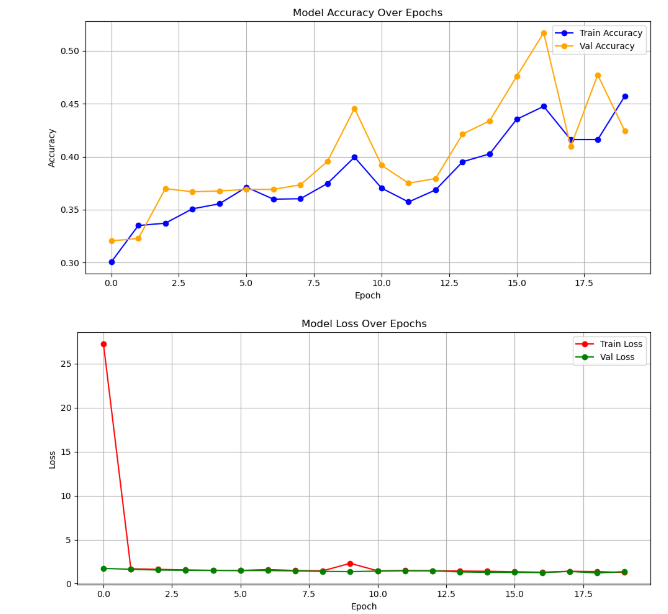

[](https://www.python.org/downloads/)
[](https://www.tensorflow.org/)
[](LICENSE)# Skin Disease Detection using Deep Learning (CNN)

Classifying dermoscopic skin lesion images into 9 disease categories using a custom Convolutional Neural Network, trained on the ISIC (International Skin Imaging Collaboration) dataset.

**Dataset:** ISIC Skin Cancer Dataset · **Classes:** 9 skin disease categories
**Framework:** TensorFlow / Keras · **Platform:** Google Colab
**Validation Accuracy:** ~60–75%

---

## Overview

Melanoma and other skin cancers are highly treatable when caught early, but diagnosis typically requires a dermatologist's visual assessment followed by biopsy — a process that can take a week or more. This project explores whether a CNN trained directly on dermoscopic images can support faster triage by classifying lesion images into one of 9 disease categories.

## Repository Structure

```
skin-disease-detection/
├── train_model.py             # Full training pipeline (data loading → CNN → training → evaluation)
├── figures/                   # Screenshots from the actual training run in Colab
│   ├── fig01_dataset_overview.png     # Dataset metadata and class distribution
│   ├── fig02_data_preprocessing.png   # Label encoding and image path mapping
│   ├── fig03_training_curves.png      # Accuracy/loss curves over training epochs
│   └── ...                            # Additional pipeline steps and outputs
├── requirements.txt
└── README.md
```

## Dataset

The dataset consists of dermoscopic skin lesion images sourced from the **ISIC (International Skin Imaging Collaboration)** archive, organized into 9 disease classes and split into train/test directories by class folder.

## Model Architecture

A custom CNN built with Keras' Sequential API:

| Layer | Details |
|---|---|
| Rescaling | Normalizes pixel values from [0, 255] to [0, 1] |
| Conv2D + MaxPooling (×3) | 16 → 32 → 64 filters, 3×3 kernels, ReLU activation |
| Flatten | Converts feature maps to a 1D vector |
| Dense | 128 units, ReLU activation |
| Output Dense | 9 units (one per class), softmax via `from_logits=True` loss |

**Training setup:** Adam optimizer, Sparse Categorical Crossentropy loss, 15 epochs, 180×180 input resolution, batch size 32, 80/20 train/validation split with a fixed seed for reproducibility.



## Results

- **Validation accuracy:** ~60–75% across training epochs
- Training and validation loss both stabilize after the first few epochs (see loss curve above), with validation accuracy tracking closely with training accuracy — suggesting the model isn't badly overfitting at this depth, though there's clear room for improvement.

**Honest limitations:**
- A custom 3-layer CNN trained from scratch on a relatively small, imbalanced 9-class medical imaging dataset is inherently limited — dermoscopic classification is a hard problem even for specialists in ambiguous cases.
- No data augmentation or class-imbalance handling (e.g. oversampling minority classes) was used in this version, which likely caps performance on underrepresented classes.
- No pretrained backbone (e.g. transfer learning from ImageNet via EfficientNet/ResNet) was used — this is a natural next step, since transfer learning tends to substantially outperform small custom CNNs on limited medical image datasets.

## Setup

```bash
pip install -r requirements.txt
```

This project was built and run in **Google Colab** (for free GPU access and easy Google Drive integration). To reproduce:

1. Upload your ISIC dataset zip to Google Drive as `SkinCancerDataset.zip`
2. Open `train_model.py` in Colab (or paste its contents into a new notebook)
3. Run top to bottom — it will mount Drive, unzip the dataset, build the CNN, train for 15 epochs, and save the model as `melanoma_skin_cancer_cnn_model.h5`

## Future Improvements

- [ ] Add data augmentation (rotation, flip, zoom) to improve generalization
- [ ] Address class imbalance (oversampling or class weighting)
- [ ] Try transfer learning with EfficientNetB0/ResNet50 as a backbone
- [ ] Add a proper held-out test set evaluation with precision/recall/F1 per class, not just accuracy
- [ ] Add a confusion matrix to see which disease classes get confused with each other
- [ ] Deploy as a simple web demo (Flask/Streamlit) for interactive testing

## License

MIT
